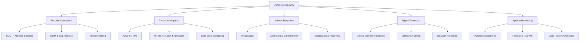
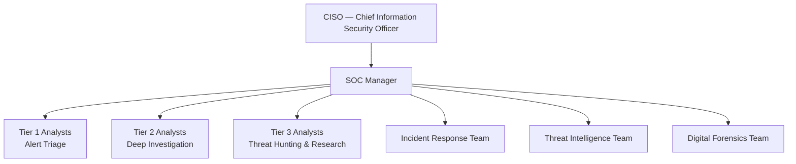
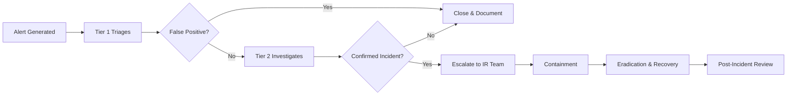
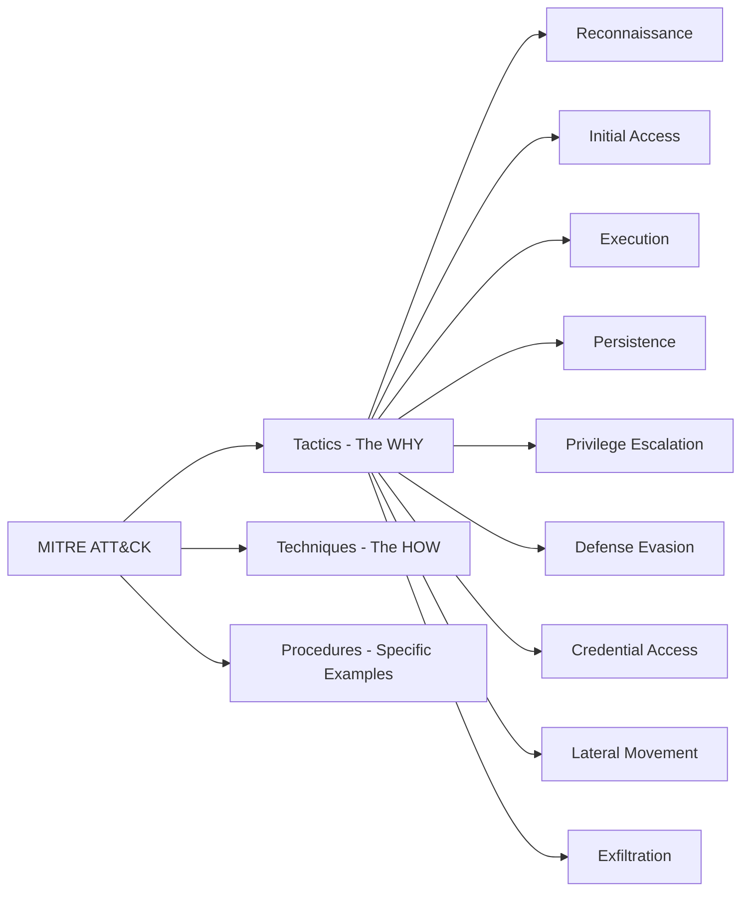
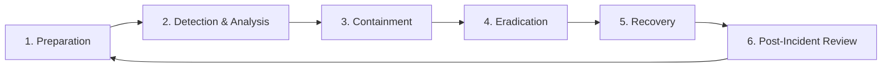
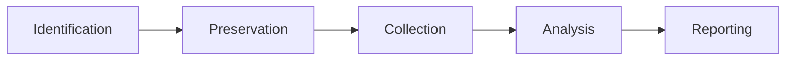
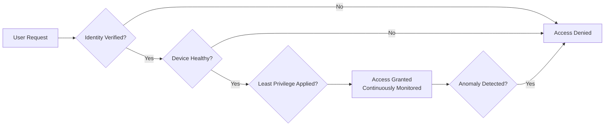
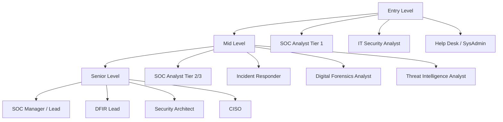

# Defensive Security Introduction 🏰

!!! abstract "What You'll Learn"
    - ✅ What Defensive Security is and why it matters
    - ✅ The Blue Team mindset — how defenders think
    - ✅ Security Operations Center (SOC) — structure & workflow
    - ✅ Threat Intelligence, SIEM, and log analysis
    - ✅ Incident Response — step-by-step process
    - ✅ Key defensive technologies & how they work
    - ✅ Digital Forensics & Malware Analysis
    - ✅ Hardening systems, networks & applications
    - ✅ Career paths, certifications & where to practice

---

## 📖 Introduction

**Defensive Security** is the practice of protecting systems, networks, and data from attacks. While offensive security tries to **break in**, defensive security focuses on **detecting, preventing, and responding** to threats.

!!! tip "Think of it this way"
    Defensive security is like running a hospital 🏥. You have guards at the door (firewalls), cameras everywhere (monitoring), doctors on call 24/7 (incident responders), and a plan for when something goes wrong (incident response). The goal is to keep everyone safe and respond fast when something bad happens.

!!! info "Offensive vs Defensive Security"
    - **Offensive Security** = The testers who find holes in the walls 🗡️
    - **Defensive Security** = The team that builds, monitors, and repairs those walls 🏰
    Both sides are essential — a strong defense is built by understanding how attackers think.

!!! warning "Defence is Never 'Done'"
    Cyber threats evolve every day. New vulnerabilities, new malware, and new attack techniques emerge constantly. A good defender assumes they **will** be attacked and prepares accordingly. The question isn't *if* — it's *when*.

---



---

## 🧠 The Defender's Mindset

Offensive security asks: *"How can this be broken?"*
Defensive security asks: *"How will I know when something is broken — and what do I do next?"*

!!! tip "The Core Assumption"
    **Assume Breach.** Don't just try to keep attackers out — assume they may already be inside and design your defenses to detect, contain, and evict them quickly.

### The Defence-in-Depth Model

Defence-in-depth means layering multiple security controls so that if one layer fails, the next one catches the threat. No single tool or technique is enough.

```
Defence-in-Depth Layers:
┌──────────────────────────────────────────────────┐
│  Layer 7 — Policies & Procedures                 │
│  (Security policies, user training, compliance)  │
├──────────────────────────────────────────────────┤
│  Layer 6 — Physical Security                     │
│  (Locked server rooms, badge access, cameras)    │
├──────────────────────────────────────────────────┤
│  Layer 5 — Perimeter Security                    │
│  (Firewalls, DMZ, VPN, DDoS protection)          │
├──────────────────────────────────────────────────┤
│  Layer 4 — Network Security                      │
│  (IDS/IPS, network segmentation, VLANs)          │
├──────────────────────────────────────────────────┤
│  Layer 3 — Endpoint Security                     │
│  (Antivirus, EDR, host-based firewalls)          │
├──────────────────────────────────────────────────┤
│  Layer 2 — Application Security                  │
│  (Secure coding, WAF, input validation)          │
├──────────────────────────────────────────────────┤
│  Layer 1 — Data Security                         │
│  (Encryption, DLP, access control, backups)      │
└──────────────────────────────────────────────────┘
         ↑ If one layer fails, the next catches it
```

### The CIA Triad (What Defenders Protect)

| Goal | What It Means | Defensive Control |
|------|--------------|-------------------|
| 🔒 **Confidentiality** | Only authorized people can read data | Encryption, access control, MFA |
| ✏️ **Integrity** | Data is not tampered with | Hashing, digital signatures, audit logs |
| ⚡ **Availability** | Systems stay online and accessible | Backups, redundancy, DDoS protection |

---

## 🏢 Security Operations Center (SOC)

A **SOC** is a centralized team of security professionals who monitor an organization's IT environment **24 hours a day, 7 days a week** to detect and respond to threats.

!!! info "Real-Life Analogy"
    A SOC is like the **control room of an airport** 🛫. Air traffic controllers watch dozens of radar screens, track every plane, communicate constantly, and respond immediately when something goes off course. The SOC does the same — but for network traffic and security events.

### SOC Team Structure



| Role | Responsibility | Skills Needed |
|------|---------------|---------------|
| **Tier 1 Analyst** | Monitor alerts, triage, close false positives | SIEM basics, networking, log reading |
| **Tier 2 Analyst** | Deep-dive investigations, correlate events | Malware analysis, forensics, threat intel |
| **Tier 3 Analyst** | Proactive threat hunting, build detection rules | Advanced forensics, reverse engineering |
| **IR Team** | Contain and recover from active incidents | Incident response playbooks, forensics |
| **Threat Intel** | Research attacker TTPs, feed indicators to SIEM | OSINT, dark web monitoring, reporting |

### SOC Workflow



!!! tip "False Positive Problem"
    A large organization can generate **millions of security alerts per day**. The majority are false positives (harmless events flagged incorrectly). A skilled Tier 1 analyst quickly separates noise from real threats — this is one of the hardest parts of the job.

---

## 📊 SIEM — Security Information & Event Management

A **SIEM** is the central nervous system of a SOC. It **collects logs from every device** in the organization, correlates them, and generates alerts when suspicious patterns are detected.

!!! info "Real-Life Analogy"
    Imagine every door, window, and camera in a building sending status updates to one security desk every second. The SIEM is that security desk — it reads everything, looks for patterns, and rings the alarm when something looks wrong.

```
How SIEM Works:
┌─────────────┐   ┌─────────────┐   ┌─────────────┐
│  Firewall   │   │  Web Server │   │  Windows PC │
│   Logs      │   │   Logs      │   │   Logs      │
└──────┬──────┘   └──────┬──────┘   └──────┬──────┘
       │                 │                 │
       └────────────┬────┘─────────────────┘
                    ▼
           ┌────────────────┐
           │   SIEM Engine  │  ← Collects, Normalizes & Correlates
           │  (Splunk/QRadar│
           │  /Elastic SIEM)│
           └───────┬────────┘
                   │
        ┌──────────┴──────────┐
        ▼                     ▼
  ┌──────────┐         ┌──────────────┐
  │  Alerts  │         │  Dashboards  │
  │  & Cases │         │  & Reports   │
  └──────────┘         └──────────────┘
```

### Reading Logs

Logs are the raw material of defensive security. Everything that happens on a system is recorded in a log.

=== "Windows Event Logs"
    ```
    Key Event IDs to Know:

    4624  → Successful Login          ✅ Normal
    4625  → Failed Login              ⚠️ Watch for repeated failures
    4648  → Login with explicit creds ⚠️ Could be lateral movement
    4720  → New user account created  ⚠️ Unauthorized account?
    4732  → User added to Admin group 🚨 Privilege escalation!
    4688  → New process created       ⚠️ Watch for cmd.exe, powershell
    7045  → New service installed     🚨 Could be malware persistence
    1102  → Audit log cleared         🚨 Attacker covering tracks!
    ```

=== "Linux Auth Logs"
    ```bash
    # Location of key log files
    /var/log/auth.log      → Authentication attempts
    /var/log/syslog        → General system events
    /var/log/apache2/      → Web server access & errors
    /var/log/kern.log      → Kernel events

    # Find failed SSH logins
    grep "Failed password" /var/log/auth.log

    # Find successful logins
    grep "Accepted password" /var/log/auth.log

    # Watch logs in real time
    tail -f /var/log/auth.log
    ```

=== "Network Logs (Firewall)"
    ```
    Sample Firewall Log Entry:
    2025-01-15 03:22:11 | DENY | SRC=185.220.101.1 DST=10.0.0.5
                        | PROTO=TCP | SPT=54231 | DPT=22 | ...

    What this tells us:
    - Date/Time: 3am (suspicious — off-hours)
    - Action: DENY (firewall blocked it)
    - Source IP: 185.220.101.1 (external — check reputation!)
    - Destination: 10.0.0.5 (internal server)
    - Port 22: SSH — someone tried to connect remotely
    - Finding: Blocked SSH brute-force attempt from external IP
    ```

=== "Common SIEM Platforms"
    ```
    Enterprise (Paid):
    Splunk        → Most widely used, powerful query language (SPL)
    IBM QRadar    → Enterprise SIEM with AI correlation
    Microsoft Sentinel → Cloud-native SIEM on Azure

    Open Source (Free):
    Elastic SIEM (ELK Stack) → Elasticsearch + Logstash + Kibana
    Wazuh         → Host-based IDS + SIEM capabilities
    Graylog       → Log management and SIEM
    ```

---

## 🕵️ Threat Intelligence

**Threat Intelligence** is knowledge about attackers — who they are, what they want, and how they operate. This intelligence helps defenders prepare for and detect specific threats.

!!! info "Types of Threat Intelligence"

    | Type | Audience | Example |
    |------|---------|---------|
    | **Strategic** | Executives, CISO | "Nation-state actors are targeting our industry" |
    | **Tactical** | Security architects | "Attackers are using phishing with fake invoice PDFs" |
    | **Operational** | SOC analysts | "IP 1.2.3.4 is actively scanning port 22" |
    | **Technical** | Analysts, tools | Malware hashes, malicious domains, IP blacklists |

### Indicators of Compromise (IOCs)

IOCs are **evidence that a system has been compromised**. They are the digital fingerprints left by attackers.

```
Common IOC Types:
┌──────────────────┬─────────────────────────────────────────┐
│ IOC Type         │ Example                                 │
├──────────────────┼─────────────────────────────────────────┤
│ IP Address       │ 185.220.101.45 (known C2 server)        │
│ Domain           │ update-windows-security[.]com           │
│ URL              │ http://malicious.site/payload.exe       │
│ File Hash (MD5)  │ 5d41402abc4b2a76b9719d911017c592        │
│ File Hash (SHA256)│ e3b0c44298fc1c149afb...               │
│ File Name        │ svchost32.exe (fake Windows process)    │
│ Registry Key     │ HKLM\Software\Microsoft\Windows\Run\... │
│ Email Subject    │ "Urgent: Invoice #8821 Due Today"       │
└──────────────────┴─────────────────────────────────────────┘
```

### MITRE ATT&CK Framework

The **MITRE ATT&CK** framework is a globally-recognized knowledge base of **attacker tactics and techniques** based on real-world observations.



!!! tip "Why ATT&CK Matters for Defenders"
    If you know an attacker group typically uses **spear phishing** for Initial Access and **Mimikatz** for Credential Access, you can:
    - Write SIEM rules to detect those specific techniques
    - Run tabletop exercises simulating that attack path
    - Prioritize defenses that block those exact methods

### Threat Intelligence Tools

| Tool | Purpose |
|------|---------|
| **VirusTotal** | Scan files/URLs/IPs against 70+ antivirus engines |
| **Shodan** | Find exposed devices; monitor your own attack surface |
| **AbuseIPDB** | Check if an IP has been reported for malicious activity |
| **AlienVault OTX** | Community-shared threat intelligence feeds |
| **MISP** | Open source threat intelligence sharing platform |
| **Any.run** | Interactive malware sandbox for behavioral analysis |
| **URLScan.io** | Analyze suspicious URLs safely |

---

## 🚨 Incident Response (IR)

**Incident Response** is the structured process of handling a cyberattack or security breach. A fast, organized response limits damage, reduces recovery time, and preserves evidence.

!!! info "Real-Life Analogy"
    Incident response is like the **fire department** 🚒. They don't just show up and spray water everywhere — they follow a precise process: assess the scene, contain the fire, put it out, make sure it doesn't restart, and then investigate the cause.

### The IR Lifecycle



---

### 1️⃣ Preparation

Build your defenses and response capabilities **before** an incident happens.

```
Preparation Checklist:
┌────────────────────────────────────────────────┐
│  📋 Incident Response Plan documented          │
│  📞 Contact list for IR team & stakeholders    │
│  🛠️ IR toolkit ready (forensic tools, etc.)   │
│  📦 Backups tested and stored offline          │
│  🔍 Logging enabled on all critical systems    │
│  🎭 Tabletop exercises conducted regularly     │
│  📜 Legal counsel & law enforcement contacts   │
│  🔐 Jumpbag ready (isolated response laptop)   │
└────────────────────────────────────────────────┘
```

!!! tip "Playbooks"
    A **playbook** is a pre-written step-by-step guide for responding to a specific type of incident (ransomware, data breach, phishing, insider threat). Having playbooks means responders don't waste precious time figuring out what to do next during a crisis.

---

### 2️⃣ Detection & Analysis

Identify that an incident has occurred and understand its scope.

=== "Detection Sources"
    ```
    Where incidents are typically discovered:

    🔔 SIEM alert          → Automated rule fired
    📧 User report         → "I clicked something weird..."
    🤖 EDR / Antivirus     → Malware detected on endpoint
    🌐 Threat Intelligence → IOC matched in network traffic
    🔍 Threat Hunting      → Analyst proactively found anomaly
    💼 External party      → Partner or researcher notifies you
    🕵️ Attacker contact    → Ransomware note left on desktop
    ```

=== "Incident Severity Levels"
    ```
    P1 — Critical 🔴
    → Active data breach, ransomware spreading, systems down
    → Response time: Immediately (within minutes)

    P2 — High 🟠
    → Confirmed malware on endpoint, privileged account compromise
    → Response time: Within 1 hour

    P3 — Medium 🟡
    → Phishing email opened, suspicious network traffic
    → Response time: Within 4 hours

    P4 — Low 🟢
    → Policy violation, spam campaign, minor anomaly
    → Response time: Within 24 hours
    ```

=== "Key Questions to Answer"
    ```
    During Detection & Analysis, answer these:

    WHAT:  What type of incident is this?
           (Malware? Data breach? Insider threat? DDoS?)

    WHEN:  When did it start? (Check logs for earliest evidence)

    WHERE: Which systems are affected?
           (One machine? The whole domain? Cloud?)

    WHO:   Which user account was involved?
           (Compromised credentials? Insider?)

    HOW:   What was the initial entry point?
           (Phishing email? Unpatched vulnerability?)

    SCOPE: How far has the attacker spread?
           (Lateral movement detected?)
    ```

---

### 3️⃣ Containment

Stop the attack from spreading further. Speed is critical here.

=== "Short-Term Containment"
    ```bash
    # Isolate infected machine from network immediately
    # (On Windows — disable network adapter)
    netsh interface set interface "Ethernet" admin=disable

    # Block malicious IP at the firewall
    iptables -A INPUT -s 185.220.101.1 -j DROP
    iptables -A OUTPUT -d 185.220.101.1 -j DROP

    # Disable compromised user account
    net user john.doe /active:no          # Windows
    usermod -L john.doe                   # Linux

    # Reset compromised credentials
    # Change passwords for affected accounts
    # Revoke API keys, certificates, tokens
    ```

=== "Evidence Preservation"
    ```
    ⚠️ Before wiping anything — preserve evidence!

    Collect in this order (most volatile first):
    1. RAM memory dump  → Running processes, encryption keys
    2. Network connections → Active connections at time of incident
    3. Running processes → What's currently executing
    4. Disk image       → Full forensic copy of the hard drive
    5. Log files        → Export before they rotate/are deleted

    Tools:
    - Volatility   → Memory forensics
    - FTK Imager   → Disk imaging
    - Wireshark    → Capture live network traffic
    - Velociraptor → Enterprise-scale forensic collection
    ```

---

### 4️⃣ Eradication

Remove the threat completely from the environment.

```
Eradication Steps:
┌─────────────────────────────────────────────────┐
│  🔍 Identify root cause (how did they get in?)  │
│  🗑️ Remove malware, backdoors, web shells       │
│  👤 Delete attacker-created accounts            │
│  🔑 Rotate ALL compromised credentials          │
│  🔒 Patch the exploited vulnerability           │
│  🛡️ Update AV/EDR signatures                   │
│  🔎 Scan all systems for related IOCs           │
│  ✅ Verify no persistence mechanisms remain     │
└─────────────────────────────────────────────────┘
```

!!! warning "Don't Rush Eradication"
    Make sure you've found **all** of the attacker's footholds before eradicating. If you miss one backdoor, they'll be back inside within hours. Attackers often create multiple persistence mechanisms specifically for this scenario.

---

### 5️⃣ Recovery

Bring systems back online safely.

```
Recovery Process:
┌────────────────────────────────────────────────┐
│  1. Restore from clean backups (pre-infection) │
│  2. Rebuild compromised systems from scratch   │
│  3. Re-enable network connectivity in stages   │
│  4. Monitor closely for re-infection           │
│  5. Verify systems are functioning normally    │
│  6. Gradually restore full operations          │
│  7. Notify stakeholders of recovery status     │
└────────────────────────────────────────────────┘
```

---

### 6️⃣ Post-Incident Review (Lessons Learned)

After recovery, analyse what happened and improve your defenses.

!!! tip "The Most Important Phase Nobody Does"
    Most organizations skip this step. This is a mistake. The post-incident review is where you turn a bad event into a permanent improvement to your security posture.

```
Post-Incident Report Should Answer:
┌──────────────────────────────────────────────────────┐
│  📅 Timeline  → When did each event occur?           │
│  🚪 Root Cause → How did the attacker get in?        │
│  ⏱️ Detection  → How long were they undetected?      │
│  💰 Impact    → What was the business/data impact?   │
│  ✅ What Worked → What detections/controls helped?   │
│  ❌ What Failed → Where did our defences fall short? │
│  🔧 Action Items → What will we fix, and by when?    │
└──────────────────────────────────────────────────────┘
```

---

## 🔬 Digital Forensics

**Digital Forensics** is the process of collecting, preserving, and analyzing digital evidence — often after an incident — to understand what happened and potentially support legal action.

!!! info "Real-Life Analogy"
    Digital forensics is like a **crime scene investigation** 🔍 but for computers. Just as a detective collects fingerprints and photographs without contaminating the scene, a digital forensic analyst collects evidence without altering the original data.

### The Forensic Process



### Chain of Custody

!!! warning "Critical Concept"
    **Chain of custody** is the documented, unbroken trail of who collected, handled, transferred, and analyzed evidence. Without it, evidence is inadmissible in court. Every step must be logged with timestamps, names, and hashes.

```
Chain of Custody Log:
┌──────────────┬──────────────────┬─────────────────────┐
│  Date/Time   │  Person          │  Action             │
├──────────────┼──────────────────┼─────────────────────┤
│ 2025-01-15   │ Jane Smith (IR)  │ Seized hard drive   │
│ 09:15:32     │                  │ SHA256: abc123...   │
├──────────────┼──────────────────┼─────────────────────┤
│ 2025-01-15   │ Bob Jones (Fore.)│ Received from Jane  │
│ 11:30:00     │                  │ SHA256 verified ✅  │
└──────────────┴──────────────────┴─────────────────────┘
```

### Types of Forensics

=== "Disk Forensics"
    ```bash
    # Create forensic image (never work on original!)
    dd if=/dev/sda of=/evidence/disk.img bs=4M
    # Verify integrity with hash
    sha256sum /dev/sda
    sha256sum /evidence/disk.img
    # Both hashes MUST match — proves image is unaltered

    # Mount image read-only for analysis
    mount -o ro,loop /evidence/disk.img /mnt/evidence

    # Key areas to examine:
    # - Deleted files (recovered with Autopsy/Sleuth Kit)
    # - Browser history, cookies, cached data
    # - Recently accessed files (MRU lists)
    # - Prefetch files (shows what programs ran)
    # - Registry (Windows) — user activity, installed software
    # - $MFT (Master File Table) — full file system history
    ```

=== "Memory Forensics"
    ```bash
    # Capture RAM with winpmem (Windows)
    winpmem.exe memory.raw

    # Analyse with Volatility3
    # List running processes
    python3 vol.py -f memory.raw windows.pslist

    # Find network connections
    python3 vol.py -f memory.raw windows.netstat

    # Detect injected malicious code
    python3 vol.py -f memory.raw windows.malfind

    # Dump a suspicious process
    python3 vol.py -f memory.raw windows.dumpfiles --pid 1234

    # Why memory forensics matters:
    # RAM contains: encryption keys, passwords, running malware,
    # injected shellcode, network connections — all invisible on disk!
    ```

=== "Network Forensics"
    ```bash
    # Capture live traffic
    tcpdump -i eth0 -w capture.pcap

    # Analyse in Wireshark
    # Useful filters:
    http                    → All HTTP traffic
    tcp.port == 4444        → Common reverse shell port
    ip.addr == 192.168.1.5  → Traffic to/from specific IP
    dns                     → All DNS queries (look for beaconing)
    smtp                    → Email traffic

    # Zeek (formerly Bro) — network monitoring framework
    zeek -r capture.pcap    → Generate structured logs

    # NetworkMiner — passive network forensics tool
    # Reconstructs files transferred over the network
    ```

=== "Forensic Tools"
    ```
    Disk & File Analysis:
    Autopsy          → GUI forensics platform (free)
    Sleuth Kit       → Command-line forensic toolkit
    FTK Imager       → Disk imaging and evidence collection
    Recuva           → Deleted file recovery

    Memory Analysis:
    Volatility 3     → Industry standard memory forensics
    Rekall           → Memory analysis framework

    Network Analysis:
    Wireshark        → Packet analysis GUI
    NetworkMiner     → Passive network forensics
    Zeek             → Network traffic monitoring & logging
    Arkime           → Full packet capture platform

    All-in-One:
    CAINE Linux      → Forensics-focused Linux distro
    SIFT Workstation → SANS forensic toolkit (Ubuntu-based)
    ```

---

## 🦠 Malware Analysis

**Malware Analysis** is the process of studying malicious software to understand how it works, what it does, and how to detect and remove it.

!!! info "Types of Malware"

    | Type | What It Does | Example |
    |------|-------------|---------|
    | **Virus** | Attaches to files, spreads when executed | ILOVEYOU (2000) |
    | **Worm** | Self-replicates across networks without user action | WannaCry (2017) |
    | **Trojan** | Disguised as legitimate software | Fake Adobe update with RAT |
    | **Ransomware** | Encrypts files, demands payment | LockBit, REvil |
    | **Spyware** | Secretly monitors and exfiltrates data | Keyloggers |
    | **Rootkit** | Hides itself deep in the OS | Hides attacker processes |
    | **Botnet** | Turns infected machines into zombie army | Mirai botnet |
    | **RAT** | Remote Access Trojan — full attacker control | njRAT, AsyncRAT |

### Static vs Dynamic Analysis

=== "Static Analysis (No Execution)"
    ```bash
    # Examine the file WITHOUT running it
    # Safe — malware never executes

    # Get file hash (check against VirusTotal)
    sha256sum suspicious.exe
    md5sum suspicious.exe

    # Check file type (malware often lies about type)
    file suspicious.exe

    # Look for readable strings inside binary
    strings suspicious.exe | grep -E "(http|cmd|powershell|reg)"

    # Check PE headers (Windows executable info)
    # Tools: PEStudio, PE-bear, CFF Explorer

    # Look for packed/obfuscated code
    # High entropy section = likely packed/encrypted
    # Tools: Detect-It-Easy (DIE), ExeinfoPE

    # Disassemble the binary
    # Tools: Ghidra (free), IDA Pro (industry standard)
    ```

=== "Dynamic Analysis (Execution in Sandbox)"
    ```
    Run malware in an ISOLATED sandbox environment
    and observe its behaviour

    What to Monitor:
    📁 File System   → What files does it create/modify/delete?
    🔑 Registry      → What registry keys does it create?
    🌐 Network       → What IPs/domains does it connect to?
    ⚙️ Processes     → What child processes does it spawn?
    💉 Injection     → Does it inject into other processes?

    Online Sandboxes (Submit file, get report):
    - Any.run       → Interactive sandbox, real-time view
    - VirusTotal    → Static + dynamic scan, 70+ AV engines
    - Hybrid-Analysis → Free behavioural sandbox
    - Joe Sandbox   → Detailed behavioural reports

    Local Sandbox Tools:
    - Cuckoo Sandbox → Open source automated malware analysis
    - FLARE VM       → Windows malware analysis workstation
    ```

=== "Common Malware Indicators"
    ```
    Network Indicators:
    🌐 Connects to unusual domains/IPs (C2 communication)
    📡 Regular "beaconing" — connects out every X seconds
    🔒 Uses unusual ports (4444, 1337, 8888)
    📦 Large data transfer to external IP (exfiltration)

    Host Indicators:
    📁 Creates files in %TEMP% or %APPDATA%
    🔑 Adds registry run keys (persistence)
    ⚙️ Spawns cmd.exe or powershell.exe as child process
    💉 Injects into legitimate processes (svchost.exe)
    🔐 Creates scheduled tasks for persistence
    🚫 Disables Windows Defender or firewall
    📋 Dumps LSASS memory (credential theft)
    ```

---

## 🛡️ Defensive Technologies

### Firewall

A firewall is a network security device that monitors and controls incoming and outgoing network traffic based on predefined rules.

=== "Types of Firewalls"
    ```
    Packet Filter (Layer 3/4)
    → Examines source/destination IP and port
    → Fast but no deep inspection
    → Example: iptables

    Stateful Inspection
    → Tracks the STATE of connections
    → Knows if a packet belongs to an established connection
    → More intelligent than packet filters

    Application Firewall (Layer 7 / WAF)
    → Understands application protocols (HTTP, FTP, DNS)
    → Can block SQLi, XSS, malicious payloads
    → Example: ModSecurity, Cloudflare WAF

    Next-Generation Firewall (NGFW)
    → Combines stateful + application inspection
    → Integrated IDS/IPS, threat intelligence
    → Example: Palo Alto, Fortinet, Cisco Firepower
    ```

=== "Basic iptables Rules"
    ```bash
    # Block all incoming traffic by default
    iptables -P INPUT DROP

    # Allow established connections
    iptables -A INPUT -m state --state ESTABLISHED,RELATED -j ACCEPT

    # Allow SSH only from trusted IP
    iptables -A INPUT -s 192.168.1.10 -p tcp --dport 22 -j ACCEPT

    # Allow HTTP and HTTPS
    iptables -A INPUT -p tcp --dport 80 -j ACCEPT
    iptables -A INPUT -p tcp --dport 443 -j ACCEPT

    # Block a specific malicious IP
    iptables -A INPUT -s 185.220.101.1 -j DROP

    # Save rules
    iptables-save > /etc/iptables/rules.v4
    ```

---

### IDS / IPS — Intrusion Detection & Prevention

| Feature | IDS | IPS |
|---------|-----|-----|
| **Full Name** | Intrusion Detection System | Intrusion Prevention System |
| **Action** | Detects and **alerts** | Detects and **blocks** |
| **Placement** | Out-of-band (copy of traffic) | Inline (traffic passes through) |
| **Risk** | No false-positive impact | False positives can block legit traffic |
| **Example** | Snort (detection mode), Suricata | Snort (prevention mode), Palo Alto |

=== "Snort Rule Example"
    ```bash
    # Snort Rule Syntax:
    # action protocol src_ip src_port -> dst_ip dst_port (options)

    # Detect Nmap SYN scan
    alert tcp any any -> $HOME_NET any \
    (msg:"Nmap SYN Scan Detected"; flags:S; \
    threshold: type both, track by_src, count 20, seconds 1; \
    sid:1000001;)

    # Detect SQL injection attempt in HTTP
    alert tcp any any -> $HTTP_SERVERS $HTTP_PORTS \
    (msg:"SQL Injection Attempt"; \
    content:"' OR '1'='1"; nocase; \
    sid:1000002;)

    # Detect reverse shell on port 4444
    alert tcp $HOME_NET any -> any 4444 \
    (msg:"Possible Reverse Shell - Port 4444"; \
    sid:1000003;)
    ```

---

### EDR — Endpoint Detection & Response

**EDR** solutions monitor individual endpoints (laptops, servers, workstations) in real-time to detect and respond to threats that traditional antivirus misses.

```
Traditional AV vs EDR:

Traditional Antivirus:
→ Matches files against known signature database
→ Misses: fileless malware, zero-days, LOLBins

EDR:
→ Monitors ALL behaviour on the endpoint
→ Process creation, file access, network connections, registry changes
→ Can detect: fileless malware, lateral movement, credential theft
→ Can RESPOND: isolate host, kill process, roll back changes

Popular EDR Solutions:
- CrowdStrike Falcon   → Industry leader
- Microsoft Defender for Endpoint → Built into Windows
- SentinelOne          → AI-powered EDR
- Carbon Black         → Behavioural EDR
- Velociraptor         → Open source endpoint monitoring
```

---

### Zero Trust Architecture

**Zero Trust** is a security model based on the principle: **"Never trust, always verify."**

!!! info "Traditional vs Zero Trust"
    - **Old model:** Trust everything inside the network perimeter (like a castle moat — safe inside, dangerous outside)
    - **Zero Trust:** Verify every user, every device, every request — regardless of where it comes from



| Zero Trust Principle | What It Means |
|---------------------|--------------|
| **Verify Explicitly** | Always authenticate and authorize with all data points |
| **Least Privilege** | Give users only the access they need, nothing more |
| **Assume Breach** | Design as if attackers are already inside |
| **Microsegmentation** | Divide the network into small isolated zones |
| **MFA Everywhere** | Single passwords are never enough |

---

## 🔐 System Hardening

**Hardening** is the process of reducing the attack surface of a system by removing unnecessary features, applying security configurations, and keeping software up to date.

!!! tip "Think of it this way"
    Every open port, every installed service, and every default password is a door an attacker could walk through. Hardening means closing every door you don't need and locking the ones you do.

=== "Linux Hardening"
    ```bash
    # 1. Keep everything updated
    apt update && apt upgrade -y

    # 2. Disable unnecessary services
    systemctl disable bluetooth
    systemctl disable cups        # Printing service
    systemctl disable avahi-daemon

    # 3. Configure SSH securely (/etc/ssh/sshd_config)
    PermitRootLogin no            # Never allow root SSH
    PasswordAuthentication no     # Keys only, no passwords
    MaxAuthTries 3                # Limit login attempts
    AllowUsers alice bob          # Whitelist specific users

    # 4. Set up automatic updates
    apt install unattended-upgrades
    dpkg-reconfigure unattended-upgrades

    # 5. Configure firewall (UFW — simple frontend for iptables)
    ufw default deny incoming
    ufw default allow outgoing
    ufw allow ssh
    ufw enable

    # 6. Audit listening services
    ss -tulnp                     # Show all open ports
    netstat -tulnp

    # 7. Check for SUID binaries (privilege escalation risk)
    find / -perm -4000 -type f 2>/dev/null
    ```

=== "Windows Hardening"
    ```
    1. Keep Windows and software updated
       Windows Update → Check for updates (automate this)

    2. Disable unnecessary services
       services.msc → Disable: Remote Registry, Telnet,
                      Print Spooler (if not needed)

    3. Enable Windows Firewall
       All three profiles: Domain, Private, Public

    4. Account Security
       → Rename/disable default Administrator account
       → Use strong password policy (GPO)
       → Enable account lockout after 5 failed attempts

    5. Enable Windows Defender + ASR rules
       → Attack Surface Reduction rules block common techniques

    6. Disable SMBv1 (used by WannaCry!)
       Set-SmbServerConfiguration -EnableSMB1Protocol $false

    7. Enable Audit Logging (GPO)
       → Logon events, account management, process creation
       → Ship to SIEM

    8. Apply CIS Benchmark
       → cisecurity.org → Free hardening guides for all OS
    ```

=== "Web Application Hardening"
    ```
    HTTP Security Headers (add to web server config):

    Content-Security-Policy     → Prevents XSS attacks
    X-Frame-Options: DENY       → Prevents clickjacking
    X-Content-Type-Options: nosniff → Prevents MIME sniffing
    Strict-Transport-Security   → Forces HTTPS
    Referrer-Policy             → Controls referrer info

    Other Best Practices:
    ✅ Input validation on ALL user input (server-side!)
    ✅ Parameterized queries (prevent SQL injection)
    ✅ Disable directory listing
    ✅ Remove default pages and test files
    ✅ Keep frameworks & libraries updated
    ✅ Rate limiting on login pages
    ✅ Web Application Firewall (WAF)
    ```

---

## 📦 Backup & Disaster Recovery

Backups are one of the most important defensive controls — especially against **ransomware**.

### The 3-2-1 Backup Rule

```
┌─────────────────────────────────────────────────┐
│              The 3-2-1 Rule                     │
│                                                 │
│  3  copies of your data                        │
│  2  on different storage media                 │
│  1  stored off-site (or offline)               │
│                                                 │
│  Example:                                       │
│  ✅ Copy 1: On your production server           │
│  ✅ Copy 2: On a local NAS / backup drive       │
│  ✅ Copy 3: Cloud storage or tape (off-site)    │
│                                                 │
│  ⚠️ Ransomware will encrypt all connected       │
│     drives. The offline/off-site copy is        │
│     your lifeline!                             │
└─────────────────────────────────────────────────┘
```

!!! warning "Test Your Backups!"
    An untested backup is not a backup. Regularly perform **restore drills** to ensure your backups actually work before you need them in a crisis.

---

## 👥 Security Awareness Training

The most sophisticated firewall in the world can't stop an employee from clicking a phishing link. **People are both the biggest vulnerability and the best defense.**

!!! info "Key Training Topics for All Staff"
    - How to identify phishing emails
    - Safe password practices (use a password manager!)
    - How to report suspicious activity
    - Physical security (tailgating, shoulder surfing)
    - Safe use of public Wi-Fi
    - Social engineering awareness

=== "Phishing Simulation"
    ```
    Phishing simulations test employees with fake phishing emails

    Process:
    1. Security team sends realistic phishing email to all staff
    2. Track who clicks, who enters credentials, who reports it
    3. Employees who fall for it → targeted training
    4. Repeat quarterly to measure improvement

    Platforms:
    - GoPhish (free, open source)
    - KnowBe4 (enterprise)
    - Proofpoint Security Awareness Training
    ```

=== "Password Best Practices"
    ```
    ❌ Don't:
    → Reuse passwords across sites
    → Use personal info (name, birthday, pet)
    → Use common patterns (P@ssw0rd!)
    → Share passwords

    ✅ Do:
    → Use a password manager (Bitwarden, 1Password)
    → Use unique passwords for every account
    → Enable MFA everywhere possible
    → Use long passphrases: "correct-horse-battery-staple"
    → Change passwords immediately if breach suspected
    ```

---

## 🛠️ Essential Defensive Security Tools

### Monitoring & Detection

| Tool | Purpose | Free? |
|------|---------|-------|
| **Splunk** | SIEM — log collection, correlation, alerting | Free tier available |
| **Elastic SIEM** | Open source SIEM (ELK Stack) | ✅ Free |
| **Wazuh** | Host IDS + SIEM + compliance | ✅ Free |
| **Zeek** | Network traffic analysis | ✅ Free |
| **Snort / Suricata** | Network IDS/IPS | ✅ Free |
| **Graylog** | Log management | ✅ Free |

### Endpoint Security

| Tool | Purpose | Free? |
|------|---------|-------|
| **Windows Defender** | Built-in AV + EDR (Defender for Endpoint) | ✅ Built-in |
| **CrowdStrike Falcon** | Leading enterprise EDR | Paid |
| **Velociraptor** | Open source endpoint monitoring & forensics | ✅ Free |
| **OSSEC** | Host-based IDS | ✅ Free |
| **Sysmon** | Windows event logging for detection | ✅ Free |

### Forensics & IR

| Tool | Purpose | Free? |
|------|---------|-------|
| **Autopsy** | Digital forensics platform | ✅ Free |
| **Volatility 3** | Memory forensics | ✅ Free |
| **Wireshark** | Packet capture and analysis | ✅ Free |
| **FTK Imager** | Disk imaging and evidence collection | ✅ Free |
| **Velociraptor** | Enterprise-scale forensic collection | ✅ Free |

### Vulnerability Management

| Tool | Purpose | Free? |
|------|---------|-------|
| **OpenVAS / Greenbone** | Vulnerability scanner | ✅ Free |
| **Nessus Essentials** | Vulnerability scanner (up to 16 IPs free) | ✅ Limited |
| **Trivy** | Container/code vulnerability scanner | ✅ Free |

---

## 🎓 Career Paths & Certifications

### Career Roles



### Certification Roadmap

=== "Beginner Certifications"
    ```
    CompTIA Security+
    → Industry-standard entry cert
    → Best first cert for any defensive security role
    → Covers: threats, networks, cryptography, compliance

    CompTIA CySA+ (Cybersecurity Analyst)
    → Focused on detection and response
    → Intermediate SOC analyst cert

    Google Cybersecurity Certificate
    → Free/cheap on Coursera
    → Excellent practical beginner path
    ```

=== "Intermediate Certifications"
    ```
    Blue Team Labs Online — BTLO
    → Practical blue team labs and challenges
    → Great hands-on learning for defenders

    SC-200 — Microsoft Security Operations Analyst
    → Focused on Microsoft Sentinel, Defender
    → Great if working in Microsoft environments

    EC-Council CND — Certified Network Defender
    → Network-focused defensive cert
    ```

=== "Advanced Certifications"
    ```
    GCIH — GIAC Certified Incident Handler (SANS)
    → Incident handling & response
    → Highly respected, expensive

    GCFE — GIAC Certified Forensic Examiner
    → Digital forensics focused

    GCFA — GIAC Certified Forensic Analyst
    → Advanced forensics and threat hunting

    GCIA — GIAC Certified Intrusion Analyst
    → Network traffic analysis, IDS tuning

    BTL1 — Blue Team Level 1 (Security Blue Team)
    → Practical, affordable, hands-on exam
    → Excellent value defensive cert
    ```

---

## 🧪 Where to Practice (Legally!)

=== "Online Labs"
    ```
    TryHackMe (tryhackme.com)
    → "SOC Level 1" path — excellent for beginners
    → "Cyber Defence" path — defensive focus
    → Guided and browser-based

    Blue Team Labs Online (blueteamlabs.online)
    → Purpose-built for defenders
    → SIEM investigations, malware analysis, log analysis
    → Free + paid tier

    LetsDefend (letsdefend.io)
    → SOC analyst simulation
    → Work real alerts in a simulated SOC
    → Free + paid tier

    CyberDefenders (cyberdefenders.org)
    → DFIR-focused challenges
    → Work on real malware samples & network captures
    → Free
    ```

=== "Home Lab Setup"
    ```
    Build a defensive security home lab:

    Hardware:
    → Old PC or laptop
    → Minimum 16GB RAM recommended
    → Cloud VM (AWS/Azure/GCP free tier works)

    Core Setup:
    ┌──────────────────────────────────────────┐
    │           Your Home Lab                  │
    │                                          │
    │  ┌──────────┐    ┌──────────────────┐   │
    │  │  Kali /  │    │   Wazuh SIEM     │   │
    │  │ Attacker │───▶│ (collects logs)  │   │
    │  └──────────┘    └──────────────────┘   │
    │                           ▲             │
    │  ┌──────────┐    ┌────────┴─────────┐   │
    │  │ Windows  │───▶│  Ubuntu Server   │   │
    │  │  10 VM   │    │  (target system) │   │
    │  └──────────┘    └──────────────────┘   │
    └──────────────────────────────────────────┘

    Steps:
    1. Install VirtualBox / VMware (free)
    2. Set up Wazuh (free SIEM) on Ubuntu
    3. Add Windows VM as monitored endpoint
    4. Attack from Kali, watch alerts in Wazuh
    5. Practice log analysis, IR, and detection
    ```

=== "CTF & Challenges"
    ```
    Defensive CTF Platforms:

    CyberDefenders     → DFIR & blue team focused CTFs
    BlueTeamLabs       → SOC analyst challenges
    Hack The Box Sherlocks → Forensics & DFIR challenges
    DFIR.training      → List of forensics resources & challenges

    What to Practice:
    🔍 Log Analysis     → Given logs, find the attack
    🦠 Malware Analysis → Analyse suspicious file safely
    📦 PCAP Analysis    → Find C2 communication in packet capture
    💾 Memory Forensics → What process was injecting code?
    ```

---

## 📚 Learning Resources

### Books

| Book | Author | Level | Focus |
|------|--------|-------|-------|
| **The Practice of Network Security Monitoring** | Richard Bejtlich | Beginner-Mid | NSM & SOC |
| **Blue Team Handbook** | Don Murdoch | Beginner-Mid | Incident Response |
| **The Art of Memory Forensics** | Ligh, Case, Levy, Walters | Advanced | Memory Forensics |
| **Incident Response & Computer Forensics** | Luttgens, Pepe, Mandia | Intermediate | DFIR |
| **Intelligence-Driven Incident Response** | Rebekah Brown & Scott Roberts | Intermediate | Threat Intel + IR |

### Online Resources

=== "Free Resources"
    ```
    SANS Internet Storm Center (isc.sans.edu)
    → Daily threat reports and security diaries

    Cybersecurity & Infrastructure Security Agency (cisa.gov)
    → Alerts, advisories, best practice guides

    MITRE ATT&CK (attack.mitre.org)
    → Attacker techniques database, free

    NIST Cybersecurity Framework (nist.gov/cyberframework)
    → Gold standard framework for security programs

    13Cubed (YouTube)
    → Excellent DFIR and Windows forensics tutorials

    John Hammond (YouTube)
    → Malware analysis, CTF, forensics

    The DFIR Report (thedfirreport.com)
    → Real intrusion reports with full IOCs and TTPs
    ```

=== "Paid Courses"
    ```
    SANS Institute        → World-class, expensive, gold standard
    TCM Security Academy  → Affordable, practical SOC/DFIR courses
    Blue Team Labs Online → Subscription-based practical labs
    Cybrary               → Wide range of defensive courses
    ```

---

## ✅ Quick Reference Summary

| Concept | Description | Key Takeaway |
|---------|-------------|-------------|
| **Defensive Security** | Protect, detect, and respond to threats | The shields to offensive's swords |
| **SOC** | 24/7 team monitoring for threats | Central hub of all security operations |
| **SIEM** | Collect and correlate logs for alerts | If it's not logged, it didn't happen |
| **Threat Intelligence** | Knowledge about attacker TTPs | Know your enemy |
| **IOC** | Indicators that a system is compromised | Digital fingerprints of attackers |
| **MITRE ATT&CK** | Framework of real attacker techniques | Common language for defenders |
| **Incident Response** | Structured process to handle a breach | Preparation is everything |
| **Digital Forensics** | Collect and analyze digital evidence | Preserve first, analyze second |
| **Malware Analysis** | Understand what malware does | Static = safe, Dynamic = detailed |
| **Defence-in-Depth** | Layer multiple security controls | No single tool is enough |
| **Zero Trust** | Never trust, always verify | Default deny everything |
| **Hardening** | Reduce attack surface of systems | Less is more |
| **3-2-1 Backup** | 3 copies, 2 media, 1 off-site | Your last line of defence vs ransomware |

!!! tip "Where to Start"
    1. 🎯 Create a free account on **TryHackMe.com** — start the **"SOC Level 1"** path
    2. 📺 Watch **13Cubed** on YouTube for Windows forensics fundamentals
    3. 🛠️ Set up **Wazuh** in a VM and start reading your own logs
    4. 🔍 Try a beginner challenge on **CyberDefenders.org**
    5. 📄 Aim for **CompTIA Security+** as your first certification

!!! info "The Blue Team Motto"
    *"Offence informs defence."* The best defenders understand how attackers think. Study offensive security concepts too — understanding the attack is what makes your detection rules accurate and your defenses effective.